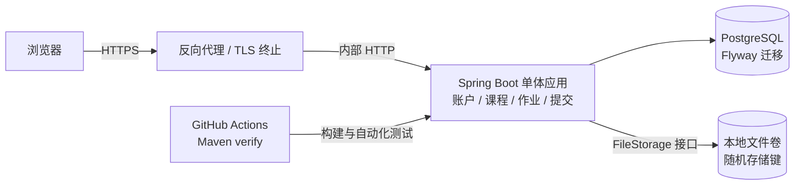

# 课序：课程作业提交平台

一个可独立启动的中文课程作业平台。教师创建课程和发布作业，学生通过邀请码加入课程并提交文件；系统保留每次提交的版本、时间、迟交状态和文件摘要。

## 功能

- 学生自助注册、登录与退出；管理员通过环境变量首次引导，管理员可以将注册用户设为教师。
- 教师创建课程、分享邀请码、发布作业并设置截止时间和是否接收迟交。
- 学生加入课程、查看作业、提交新版本并查看历史记录；教师可查看本课程学生和提交并下载。
- PDF、DOC、DOCX 上传，单文件上限 10 MiB；校验扩展名和基本文件签名，存储使用随机键。
- 下载按学生本人或教师课程归属授权；文件名只作为下载元数据，不用于磁盘路径。
- 存储由 FileStorage 接口隔离，默认使用本地文件卷；数据库由 Flyway 管理。
- Spring Security 会话、BCrypt、CSRF、HttpOnly/SameSite Cookie、安全响应头，以及 PostgreSQL 健康检查和 GitHub Actions 构建。

## 技术选择

| 组件 | 版本/方案 | 选择原因 |
|---|---|---|
| Java | 21 | LTS，当前项目开发环境可直接运行，受本项目 Spring Boot 版本支持 |
| Spring Boot | 4.1.1 | 稳定版单体 Web、Security、JPA 与模板支持 |
| Maven | Wrapper 3.3.4，Maven 3.9.16 | 不依赖全局安装，固定并校验下载发行包 |
| PostgreSQL | 18.6 | 当前受支持主版本；Compose 数据持久化到命名卷 |
| Flyway | 12.4.0（由 Boot BOM 管理） | 版本化数据库迁移，启动时校验表结构 |
| 上传存储 | 本地卷，可配置目录 | 与业务服务隔离，便于以后替换对象存储实现 |

详细的目标、改造前基线和验收范围见 [目标报告](docs/target-report.md)。真实实现和验证记录见 [实现报告](docs/implementation-report.md)。
简历表述与面试讨论提纲见 [项目说明](docs/resume-notes.md)。

## 架构

## 首次启动（Docker Compose）

需要 Docker Engine/桌面版及 Compose v2。先在项目目录复制环境变量模板：

~~~sh
cp .env.example .env
~~~

使用密码管理器或系统随机数生成器为 PostgreSQL 与引导管理员分别设置独立密码。管理员密码至少 12 个字符，最多 72 个 UTF-8 字节。不要把真实密码写入模板或提交 `.env`。Windows PowerShell 可用以下命令生成 32 字节随机十六进制值：

~~~powershell
$bytes = [byte[]]::new(32)
[Security.Cryptography.RandomNumberGenerator]::Fill($bytes)
[Convert]::ToHexString($bytes)
~~~

在 `.env` 中填写 `DB_PASSWORD`、`APP_BOOTSTRAP_ADMIN_USERNAME` 和 `APP_BOOTSTRAP_ADMIN_PASSWORD`。上传单文件上限为 10 MiB、单请求上限为 12 MiB；反向代理也应设置匹配的请求大小限制。首次运行会创建管理员；若数据库里已有该用户名，启动不会更改现有账户。

~~~sh
docker compose up --build -d
docker compose logs -f app
~~~

浏览器打开 <http://localhost:8080>。注册学生账号后，由管理员进入“用户管理”授予教师角色。教师创建课程并把邀请码交给学生；学生加入后可查看并提交作业。部署到 HTTPS 时，在 `.env` 设置 `APP_COOKIE_SECURE=true` 并由反向代理终止 TLS。

停止应用但保留数据库和上传文件：

~~~sh
docker compose down
~~~

清除数据库与上传卷会永久删除数据：只有确实要重置演示环境时才显式执行 `docker compose down -v`。

## 本机开发与验证

需要 JDK 21；无需预装 Maven。

~~~sh
./mvnw test
./mvnw verify
~~~

Windows PowerShell：

~~~powershell
.\mvnw.cmd test
.\mvnw.cmd verify
~~~

自动化测试使用隔离的 H2 测试数据库并运行 Flyway 迁移，不需要 Docker。要连接本机 PostgreSQL 启动 Web 服务，可按 `application.yml` 提供 `DB_URL`、`DB_USERNAME`、`DB_PASSWORD`，再运行 `./mvnw spring-boot:run`（Windows 使用 `mvnw.cmd spring-boot:run`）。生产默认数据库是 PostgreSQL；H2 仅供自动化测试。

## 目录与数据

- `src/main/java`：账户、课程、作业、提交版本、授权和存储接口。
- `src/main/resources/db/migration`：Flyway SQL 迁移。
- `src/main/resources/templates`、`static`：服务端页面和静态资源。
- `uploads/`：本地开发上传目录；Compose 中映射到独立命名卷。
- `data/`：本地 PostgreSQL 数据目录预留位置；Compose 使用 Docker 命名卷。

`testfiles/` 是原实验目录中的本地样例文件，已排除在 Git 发布之外。

## 安全边界与已知限制

- DOCX 校验使用 ZIP 文件头，PDF/DOC 校验常见文件签名；签名检查不等同于完整文件解析或恶意软件扫描。
- 首版通过同一服务读取本地文件卷，不含病毒扫描、评分、作业评论、邮件找回密码或对象存储适配器。
- 单文件上限 10 MiB，上传请求上限 12 MiB；反向代理也应设置匹配的请求大小限制。
- 生产部署应使用 HTTPS、强且独立的数据库/管理员密码、私有备份，并限制应用容器与文件卷的主机访问权限。
- 仓库目前未附加开源许可证；公开可见不等于授予再分发或商用许可。
